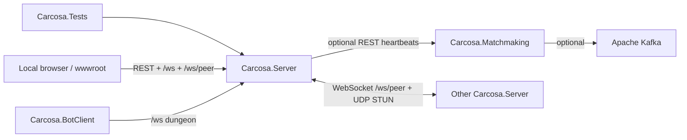

# Carcosa — .NET / C# dependency tree

**Last updated:** 2026-08-16  
Visual map of projects, folders, and the important class edges a maintainer actually follows. React lives under `src/frontend` and is not listed file-by-file here.

## Solution

```
Carcosa.slnx
├── src/backend/Carcosa.Server.csproj          # game + overworld + mesh (Native AOT web)
│     project refs: none
│     packages:    SDK web only (no Kafka)
├── src/matchmaking/Carcosa.Matchmaking.csproj # optional discovery + dashboard wwwroot
│     project refs: none
│     packages:    Confluent.Kafka 2.6.1
├── src/botclient/Carcosa.BotClient.csproj     # headless test bot (Native AOT exe)
│     project refs: none
└── src/tests/Carcosa.Tests.csproj             # xUnit
      project refs: Carcosa.Server
```



Kafka is **not** a dependency of the game server. Offline play never touches matchmaking.

---

## Carcosa.Server — folders

```
src/backend/
├── Program.cs                 # DI, static files, ALL HTTP + WS endpoints, AppJsonContext
├── Game/                      # dungeon session + 20Hz GameLoop
├── Gameplay/                  # overworld, inventory, quest, dig, save, shard host
├── P2P/                       # mesh, glyph, STUN/UDP, UPnP, shards, party
├── Network/                   # dungeon WS messages, matchmaking REST client
└── Cryptol/                   # Pale Marks store
```

### Composition at startup (`Program.cs`)

```
Program
├── PeerIdentity / PeerMesh / UdpMeshTransport / NatTraversalService / UpnpPortMapper
├── GlyphCodec / TrackerClient / MatchmakingClient
├── SaveManager ──► PlayerSaveData (v3)
├── QuestProgression ── persist hook ──► SaveManager.Save(OverworldCombatSync.BuildSaveData)
├── OverworldCombatSync.SetQuest(QuestProgression)
├── OverworldBootstrap / OverworldWorldGen / OverworldSync / WorldShard / ShardHost
├── DungeonInstanceManager(QuestProgression)
├── SessionManager(ConnectionManager, GameLoop, CryptolStore, OverworldCombatSync, QuestProgression)
└── ConnectionManager + GameLoop  (dungeon /ws)
```

---

## Networking / mesh

```
PeerMesh
├── PeerIdentity          # persisted peer-identity.json
├── PeerConnection        # one /ws/peer socket
├── PeerHandshake         # first message after WS connect
├── PeerValidator         # version / shard / capacity
├── PeerProtocol          # message type constants
├── PeerMessages
│     └── PeerMessagePayloads
├── PeerJsonContext       # AOT JSON for mesh
├── PeerExchange          # PEX + known-peers.json
├── PeerMetrics
├── GlyphCodec            # WORD-WORD-suffix; V3 encodes STUN UDP port
├── PeerAddress
├── UdpMeshTransport      # STUN + punch + optional JSON on UDP
├── NatTraversalService   # STUN servers + apply mapped address
│     └── UpnpPortMapper  # SSDP/IGD TCP map (quiet fail)
├── TrackerClient         # optional matchmaking tracker
├── OverworldSync         # 20Hz local player broadcast
├── WorldShard            # shard id / membership
├── MeshPartyManager      # combat/loot party (NOT Friends)
├── TaskAssignmentManager
└── StaticOverworldAsset
```

**Call edges**

- `Program` `/ws/peer` → `PeerMesh.HandleInboundPeerAsync`
- `POST /api/p2p/glyph/connect` → `GlyphCodec.Decode` → `PeerMesh.ConnectToPeerAsync`
- `OverworldSync` → `PeerMesh.BroadcastAsync` (`state_update`)
- `NatTraversalService.DiscoverAndApplyAsync` → `UdpMeshTransport.DiscoverStunMappedAddressAsync` + `UpnpPortMapper.TryMapTcpPortAsync`

Dungeon sockets are **not** the mesh:

```
Program /ws
└── ConnectionManager ──► InputQueue ──► GameLoop.ProcessInputs
```

---

## Player / combat (dungeon)

```
SessionManager
├── ConnectionManager
├── GameLoop
│     ├── GameState / Entity
│     ├── InputQueue
│     ├── CombatSystem ──► AbilityRegistry
│     ├── AISystem / WaveSystem / Pathfinding
│     ├── MapGenerator          # drowned dock, temple, cave, …
│     ├── GameFlowSystem
│     └── StaminaSystem.ProcessStaminaTick / ProcessIFrameTick
├── CryptolStore?               # Pale Marks on dungeon end
├── OverworldCombatSync?        # CopyLoadoutToDungeonPlayer
└── QuestProgression?           # NotifyDungeonComplete on victory
```

`SessionManager.EndGame(victory: true)` and `DungeonInstanceManager.ApplyDungeonComplete` both notify quest so Necronomicon pages can bind.

---

## Overworld / world

```
OverworldCombatSync
├── Entity (local player)
├── EnemySpawner / EnemyAI
├── CombatSystem / StaminaSystem / LootSystem
├── PlayerInventory / ItemRegistry / AbilityRegistry
├── ProgressionSystem
├── ShardHost                   # lowest peer id runs enemy AI
├── QuestProgression            # SetQuest — local flags only
└── BuildSaveData / WriteTo     # snapshot for SaveManager

OverworldWorldGen / OverworldBootstrap
└── 640×640 tiles + world objects (dream_ship, npc_merek, old_book_husk, …)

DungeonInstanceManager
├── MapGenerator (instance seed)
└── QuestProgression.NotifyDungeonComplete
```

REST the frontend actually hits (all in `Program.cs`):

| Route | Owner |
|-------|--------|
| `/api/gameplay/bootstrap`, `player-stats`, `enemies`, `projectiles`, `loot-drops` | OverworldCombatSync |
| `/api/gameplay/combat-action`, `inventory`, `equip`, `swap-abilities` | OverworldCombatSync |
| `/api/gameplay/quest`, `npc-talk`, `world-pickup`, `key-items/use` | QuestProgression |
| `/api/gameplay/friends` | QuestProgression + PeerMesh.Connections |
| `/api/gameplay/dig` | DigSystem + QuestProgression + PlayerInventory |
| `/api/gameplay/dungeon/enter`, `complete`, `map` | DungeonInstanceManager + SessionManager |
| `/api/p2p/*` | PeerMesh / Glyph / OverworldSync |

---

## Inventory / items / loot

```
ItemRegistry                 # static definitions (incl. KeyItem slot + DigSystem.Artifacts)
PlayerInventory              # 4 equipment + 12 backpack — NOT Key Items
LootSystem / LootSystemEnhancements / LootDropVisibility
CryptolShopCatalog
CryptolStore                 # Pale Marks file
AbilityRegistry
ProgressionSystem            # XP / level
```

Key Items live on `QuestProgression.KeyItemIds`, serialized through `PlayerSaveData.KeyItemIds`. Pickup-loot in `Program.cs` routes `ItemSlot.KeyItem` into quest, not backpack.

---

## Quest / save / dig (local authority — never meshed)

```
SaveManager
└── PlayerSaveData v3
      ├── backpack / equipment / abilities / fog / settings
      ├── KeyItemIds
      ├── Friends : List<SavedFriend>
      ├── NecronomiconQuestStage / Functions / Rank
      ├── DefeatedDungeonIds / CollectedWorldObjectIds / DugSpotIds
      └── See Beyond marker fields

QuestProgression
├── TalkToNpc("npc_merek")
├── PickupWorldObject("old_book_husk")
├── UseKeyItem("necronomicon" | "necronomicon_pages" | …)
├── ToggleFriend(peerId, name)
├── NotifyDungeonComplete(scenario, victory)
└── GrantKeyItem / Snapshot

DigSystem (static)
├── Artifacts[12]  ── registered into ItemRegistry static ctor
└── TryDig(quest, inventory, x, y, tileType)
```

**Invariant:** two peers in the same shard may be on different quest steps. That is intended.

---

## UI (frontend, for orientation)

Not C#, but these are the screens that call the APIs above:

```
src/frontend/
├── app/page.tsx                 # overworld vs dungeon /ws
├── components/OverworldView.tsx
├── components/OverworldCanvas.tsx / OverworldMapPanel.tsx
├── components/KeyItemsPanel.tsx / FriendsPanel.tsx
├── components/GameHUD.tsx / GameCanvas.tsx
├── hooks/useOverworldCombat.ts / useOverworldInput.ts / usePlayerStats.ts
└── lib/engine/input.ts          # dungeon RMB + contextmenu prevent
```

---

## Matchmaking (optional)

```
src/matchmaking/
├── Program.cs
├── Services/
│     ├── KafkaService.cs        # ONLY Kafka client in the repo
│     ├── SessionRegistry.cs
│     ├── PlayerStore.cs
│     └── AnalyticsService.cs
└── Overworld/                   # LEGACY dashboard overworld — not the live 640 map
      OverworldLoop, OverworldMap, PartyManager, ChatManager, …
```

`Carcosa.Server` talks to this process only through `Network/MatchmakingClient.cs` (REST).

---

## Tests (`src/tests`)

```
Carcosa.Tests  →  Carcosa.Server
├── QuestProgressionTests / DigSystemTests
├── SessionManagerTests / CombatSystemTests / EntityTests / GameStateTests
├── GlyphNatTests / NatTraversalServiceTests / PeerExchangeTests / WorldShardTests
├── LootDistributionTests / CryptolStoreTests
└── MapGeneratorTests / PathfindingTests / InputQueueTests
```

`SessionManager` extra constructor args are optional so existing tests (`new SessionManager(cm, gl)`) still compile.

---

## Important method traces

**See Beyond after Drowned Dock**

```
OverworldView enterDungeon
  → POST /api/gameplay/dungeon/enter
  → SessionManager.SelectedScenario = drowned_dock
  → page.tsx opens /ws → GameLoop
  → victory event → POST dungeon/complete victory:true
  → SessionManager.EndGame(true)
      → QuestProgression.NotifyDungeonComplete("drowned_dock", true)
          → grant pages + BindPagesUnlocked (see_beyond)
  → KeyItemsPanel Use necronomicon
      → POST /api/gameplay/key-items/use
      → QuestProgression.UseNecronomicon
      → OverworldMapPanel paints marker (ignores fog)
```

**Friends persist**

```
PauseMenu → FriendsPanel
  → GET /api/gameplay/friends  (mesh.Connections + quest.Friends)
  → POST { peerId } → QuestProgression.ToggleFriend
  → persist hook → SaveManager.Save
```

**Future mesh-split (not written)** must read `QuestProgression.Friends` / `PlayerSaveData.Friends` and keep those peer ids in the same neighborhood. Do not reuse `MeshPartyManager` for that.
